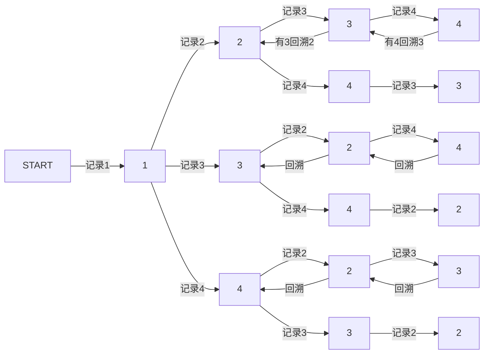

### 46. 全排列
> 给定一个 没有重复 数字的序列，返回其所有可能的全排列。

示例:
```javascript
输入: [1,2,3]
输出:
[
  [1,2,3],
  [1,3,2],
  [2,1,3],
  [2,3,1],
  [3,1,2],
  [3,2,1]
]
```
---
#### 初始解题思路：
1. 将序列中的每一条数据，分别从头排至尾 时间： O(n^2)
2. 去重
    - 因为每次从头至尾的排列时，必定与之前数值排序的情况存在重复。
    - 生成记录的大小为O(n^2)个, 对应需要n^2个循环n^2次去重 时间：O(n^4)
3. 时间复杂度和空间复杂度均过大(__思路需要优化__)
#### 优化思路：
1. 造成时间过大的部分在于去重。将去重过程优化掉，即可优化n^2量级的时间
2. 模拟人探索的方式。
3. eg: [1,2,3,4] -> 分别可以以 1、2、3、4 作为开头
    - 优化思路为记录 每次探索的每一步。
    - 因为数字不重复，所以只需要考虑下一步代表的数字是否存在与之前的记录中即可。
    - 即达到防止重复序列的生成。


> 2、3、4为开头，排序方式同上


---
#### code

```javascript
var permute = function(nums) {
    // 记录不同序列的集合
    const list = [];
    // 当前路径记录
    const record = [];
    function goBack() {
        // 当路径记录长度与基础序列长度一致时，认为生成了一条唯一序列。
        // 此时放入list中，并返回上一条路径分支
        if (record.length === nums.length) {
            return list.push([...record]);
        }
        for(let i = 0; i < nums.length; i++) {
            // 因为有前提，数字不同，可以放心比较
            if (!record.includes(nums[i])) {
                // 记录当前节点
                record.push(nums[i]);
                // 探索下一个不存在于路径中的节点
                goBack();
                // 返回上一节点, 探索下一个可以成为节点的数字
                record.pop();
            };
        }
    }
    goBack()
    return list
};
```
